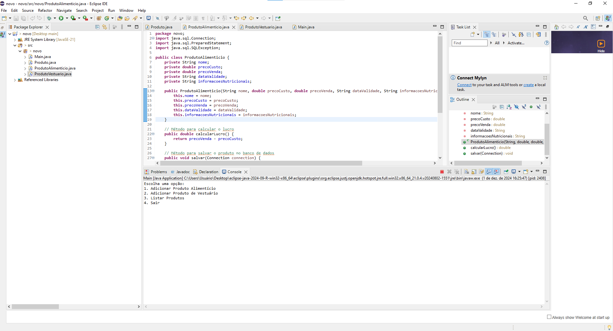
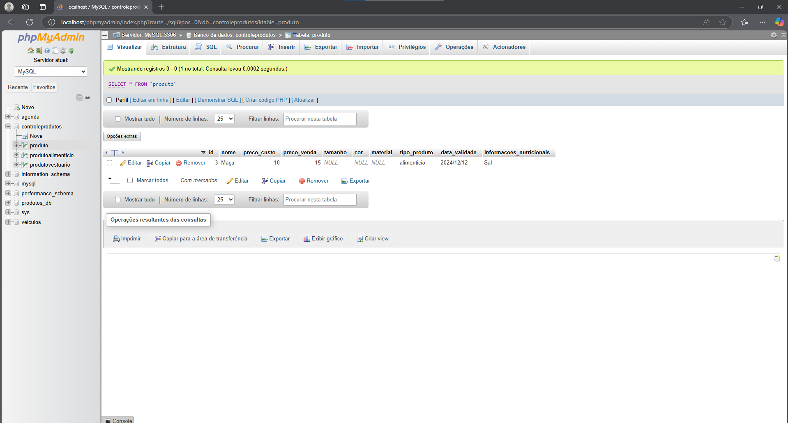
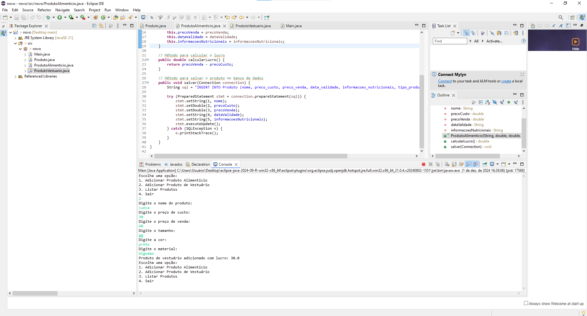
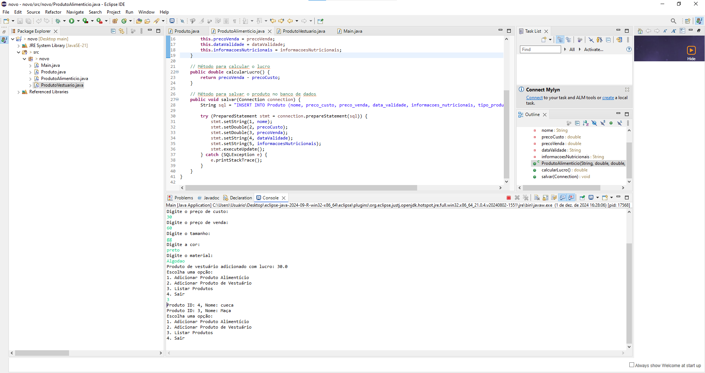
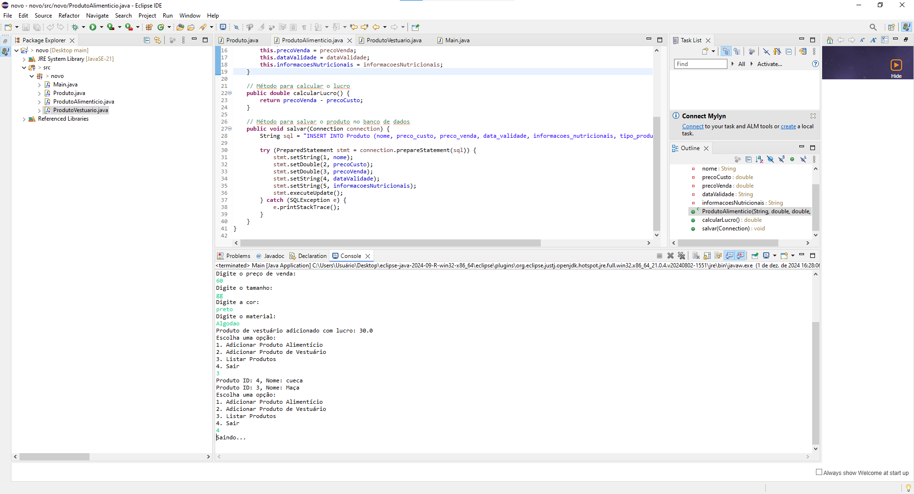

# Lista de Exercícios - CONTROLE_PRODUTOS.

Projeto da matéria de POO FACENS

## 🚀 Começando

* Crie a classe Produto que possui os atributos nome, preço de custo e preço de venda. Possui também o método concreto calcularLucro.
* A classe ProdutoAlimenticio é derivada de Produto e possui os atributos data de validade e informações nutricionais.
* A classe ProdutoVestuario possui os atributos tamanho, cor e material.
* Todas as classes devem ter métodos para salvar, deletar e atualizar registros em um banco de dados relacional.
* Crie um banco de dados relacional para conter as informações das classes solicitadas.

## 🛠️ Construído com

* EclipseIDE

## 📌 Versão

* **Versão 1.0** 

## ✒️ Autores

* **Abrão Alves Trevizan** - *CONTROLE_PRODUTOS.* 
